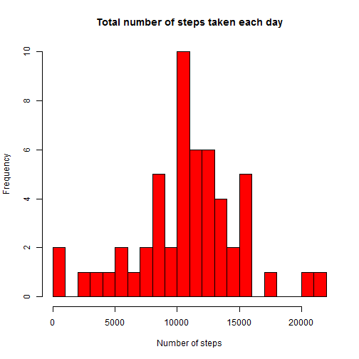
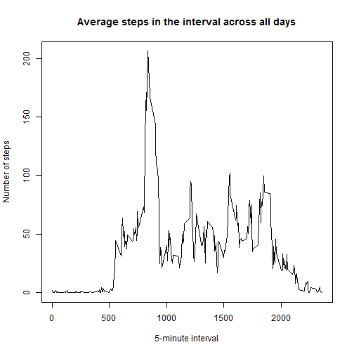
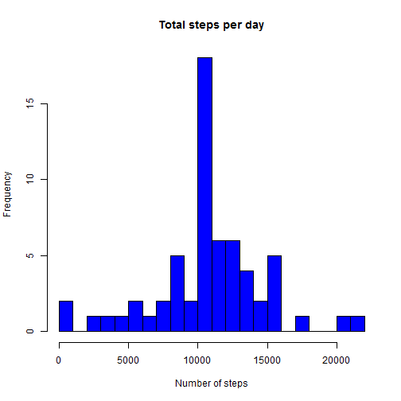
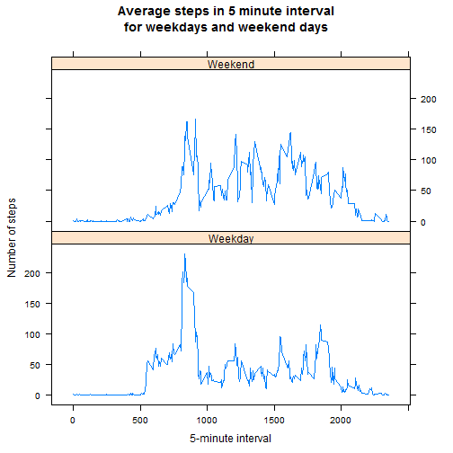

### About this assignment

This assignment makes use of data from a personal activity monitoring device. This device collects data at 5 minute intervals through out the day. The data consists of two months of data from an anonymous individual collected during the months of October and November, 2012 and include the number of steps taken in 5 minute intervals each day.

### Data Source
The data for this assignment can be downloaded from the course web site:

Dataset: (https://d396qusza40orc.cloudfront.net/repdata%2Fdata%2Factivity.zip) [52K]

The variables included in this dataset are:

steps: Number of steps taking in a 5-minute interval (missing values are coded as NA)

date: The date on which the measurement was taken in YYYY-MM-DD format

interval: Identifier for the 5-minute interval in which measurement was taken

The dataset is stored in a comma-separated-value (CSV) file and there are a total of 17,568 observations in this dataset.

### First, load the data

If file activituy.csv does not exist, unzip the package.


```r
if (!file.exists("./activity.csv")) {
        unzip("activity.zip")
}
```
Read data into data frame called activity

```r
activity <- read.csv("activity.csv", na.strings=NA)
```

### What is mean total number of steps taken per day?

We can ignore the missing values in the dataset

1. Make a histogram of the total number of steps taken each day


```r
totalStepsPerDay <- aggregate(steps ~ date, activity, sum)
hist(totalStepsPerDay$steps, main=paste("Total number of steps taken each day"), xlab="Number of steps", col="red", breaks=20)
```



2. Calculate and report the mean and median total number of steps taken per day


```r
mean(totalStepsPerDay$steps, na.rm=TRUE)
```

```
## [1] 10766.19
```

```r
median(totalStepsPerDay$steps, na.rm=TRUE)
```

```
## [1] 10765
```

### What is the average daily activity pattern?

1. Make a time series plot (i.e. `type = "l"`) of the 5-minute interval (x-axis) and the average number of steps taken, averaged across all days (y-axis)


```r
AvgStepsPerInt <- aggregate(steps ~ interval, activity, mean, na.rm=TRUE)
plot(AvgStepsPerInt$interval, AvgStepsPerInt$steps, type='l', main="Average steps in the interval across all days", xlab="5-minute interval", ylab="Number of steps")
```



2. on average across all the days in the dataset, this 5-minute interval contains the maximum number of steps


```r
AvgStepsPerInt[which.max(AvgStepsPerInt$steps),1]
```

```
## [1] 835
```

### Next, Imputing missing values

There are a number of days/intervals where there are missing values (coded as `NA`). The presence of missing days may introduce bias into some calculations or summaries of the data.

1. Calculate and report the total number of missing values in the dataset (i.e. the total number of rows with `NA`s)


```r
sum(is.na(activity$steps))
```

```
## [1] 2304
```

2. I used the mean for that day to fill in all of the missing values in the dataset, and generate a new data set called imputedData


```r
imputedData <- transform(activity, steps=(ifelse(is.na(activity$steps), AvgStepsPerInt$steps[match(activity$interval, AvgStepsPerInt$interval)], activity$steps)))
```

3. Create a new dataset called newTotalstepsPerDay that is equal to the original dataset but with the missing data filled in


```r
newTotalStepsPerDay <- aggregate(steps ~ date, imputedData, sum)
```

4. Make a histogram of the total number of steps taken each day.


```r
hist(newTotalStepsPerDay$steps, main="Total steps per day", xlab="Number of steps", col="blue", breaks=20)
```



5. Calculate and report the mean and median total number of steps taken per day.


```r
mean(newTotalStepsPerDay$steps)
```

```
## [1] 10766.19
```

```r
median(newTotalStepsPerDay$steps)
```

```
## [1] 10766.19
```

We can see that from the results, the mean does not change, but the median has a small increase. This is because we filled in the missing values with mean steps of that day, the median become closer to the mean.

### Are there differences in activity patterns between weekdays and weekends?

1. Create a new factor variable called dayofweek in the dataset with two levels -- "weekday" and "weekend" indicating whether a given date is a weekday or weekend day.


```r
imputedData$dayofweek = as.factor(ifelse(weekdays(as.Date(imputedData$date)) %in% c("Sunday", "Saturday"), "Weekend", "Weekday"))
avgStepsByWD <- aggregate(steps ~ interval + dayofweek, imputedData, mean)
```

2. I used lattice system to make a panel plot containing a time series plot (i.e. `type = "l"`) of the 5-minute interval (x-axis) and the average number of steps taken, averaged across all weekday days or weekend days (y-axis).


```r
library(lattice)
xyplot(steps ~ interval|dayofweek, data=avgStepsByWD, type='l', layout=c(1,2), main="Average steps in 5 minute interval\nfor weekdays and weekend days", xlab="5-minute interval", ylab="Number of steps")
```


